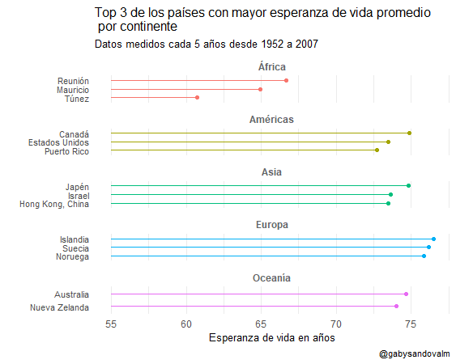

# DesafioFlorenceNightingale

#30díasdegráficos con R [más detalles.](https://github.com/cienciadedatos/datos-de-miercoles/blob/master/30-dias-de-graficos-2020.md)

En mi caso son menos de 30 días porque me uní un poco tarde al desafío, pero igual vamos...

### Día 12. Gráfica de paleta o llolipop plot. 
Una alternativa de visualización para el gráfico de barras.

